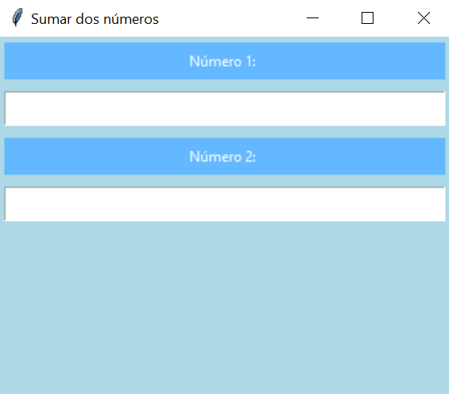

# Guía Interfaz Gráfica
En esta guía les mostraremos paso a paso cómo realizar la suma de dos números implementando una interfaz gráfica en Python.

#### Requerimientos
- Editor de código (Preferentemente **Visual Studio Code**)
- Python 3

#### Resultados esperados
<p align="center"> 
   
</p>


## Instrucciones
#### Importar la librería Tkinter
Primeramente debemos de importar la librería Tkinter, la cual ya viene preinstalada con Python 3. Esta nos otorga todas las herramientas necesarias para crear nuestra interfaz desde cero.

`from tkinter import *`

#### Crear la raíz
La raíz es el primer elemento que debemos crear, pues es donde estarán todos nuestros demás elementos llamados **Widgets**.
Después de ello, le pondremos un título, un tamaño y un color de fondo; esto le irá dando más forma a nuestra interfaz. Además colocaremos una variable que nos servirá más adelante.
Y para que funcione solamente añadiremos un método llamado ***mainloop***.

###### Código resultante:
```
ventana = Tk()
ventana.title("Sumar dos números")
ventana.geometry("380x300")
ventana.config(background = 'dark turquoise')
suma = StringVar()
ventana.mainloop()
```
<p align="center"> 
   
</p>


#### Crear primer entrada
Ahora lo que nos corresponde es realizar el primer ***Entry***, que no es más que el widget que nos permitirá introducir nuestro primer número, sin embargo, a este le acompañará un ***Label*** que es un pequeño cuadro de texto donde le indicaremos al usuario que ahí debe introducir el primer valor.

```
e1 = Label(ventana, text =  "Número 1: ", bg = "pink", fg = "white")
entrada1 = Entry(ventana)
```
Ahora ya creamos nuestro texto y nuestra entrada de datos, pero estos aún no se encuentran en nuestra raíz, es por ello que debemos empaquetarlos.

###### Código resultante:
```
e1 = Label(ventana, text =  "Número 1: ", bg = "SteelBlue1", fg = "white")
e1.pack(padx = 5, pady = 5, ipadx = 5, ipady = 5, fill = X)
entrada1 = Entry(ventana)
entrada1.pack(fill = X, padx = 5, pady = 5, ipadx = 5, ipady = 5)
```

#### Crear segunda entrada
Para crear nuestro segundo Entry y Label, repetiremos el mismo proceso que hicimos anteriormente, solamente cambiaremos el nombre de nuestras variables.

###### Código resultante:
```
e2 = Label(ventana, text =  "Número 2: ", bg = "SteelBlue1", fg = "white")
e2.pack(padx = 5, pady = 5, ipadx = 5, ipady = 5, fill = X)
entrada2 = Entry(ventana)
entrada2.pack(fill = X, padx = 5, pady = 5, ipadx = 5, ipady = 5)
```

<p align="center"> 
   
</p>


#### Crear botón de suma
Ahora nos toca hacer funcionar nuestra interfaz, pues aunque ya podemos introducir números, esta no realiza nada con ellos.
Primero crearemos un botón y le asignaremos un parámetro fundamental, el cual es ***command***, este nos permite ejecutar una función que se encuentre en nuestro código cada que se pulse el botón. Tras esto, solo nos queda empaquetar nuestro botón.

###### Código resultante:
```
botonSuma = Button(ventana, text = "SUMAR", fg = "blue", command = SumarNumeros)
botonSuma.pack(side = TOP)
```
#### Crear función de suma
Nuestro botón ya tiene la orden para ejecutar una función llamada **SumarNumeros**, pero esta aún no existe en nuestro código, es por ello que vamos a crearla a continuación.
Para esta función utilizaremos tres variables:
- Suma
- entrada1
- entrada2
Para las variables de entrada utilizaremos un método llamado ***get***, el cual recolecta la información introducida en nuestras entradas, la cual pasaremos a enteros y la sumaremos para guardarla en suma; por último solo nos queda retornar el valor utilizando el método ***set***.

###### Código resultante:
```
def SumarNumeros():
    sumar = int(entrada1.get()) + int(entrada2.get())
    return suma.set(sumar)
```

#### Mostrar el resultado
Para terminar, solo nos queda mostrar el resultado de nuestra suma, para esto, debemos crear un Laben y empaquetarlo como ya realizamos con anterioridad.

###### Código resultante:
```
resultado = Label(ventana, bg = "white", textvariable = suma, padx = 5, pady = 5, width = 50)
resultado.pack(padx = 5, pady = 5)
```
## Código final
```
from tkinter import *

def SumarNumeros():
    sumar = int(entrada1.get()) + int(entrada2.get())
    return suma.set(sumar)

ventana = Tk()
ventana.title("Sumar dos números")
ventana.geometry("380x300")
ventana.config(background = 'light blue')
suma = StringVar()

#?Numero 1
e1 = Label(ventana, text =  "Número 1: ", bg = "SteelBlue1", fg = "white")
e1.pack(padx = 5, pady = 5, ipadx = 5, ipady = 5, fill = X)
entrada1 = Entry(ventana)
entrada1.pack(fill = X, padx = 5, pady = 5, ipadx = 5, ipady = 5)

#?Numero 2
e2 = Label(ventana, text =  "Número 2: ", bg = "SteelBlue1", fg = "white")
e2.pack(padx = 5, pady = 5, ipadx = 5, ipady = 5, fill = X)
entrada2 = Entry(ventana)
entrada2.pack(fill = X, padx = 5, pady = 5, ipadx = 5, ipady = 5)

#?Botón suma
botonSuma = Button(ventana, text = "SUMAR", fg = "blue", command = SumarNumeros)
botonSuma.pack(side = TOP)

#?Mostrar resultado
resultado = Label(ventana, bg = "white", textvariable = suma, padx = 5, pady = 5, width = 50)
resultado.pack(padx = 5, pady = 5)

ventana.mainloop()
```

<p align="center"> 
   
</p>
